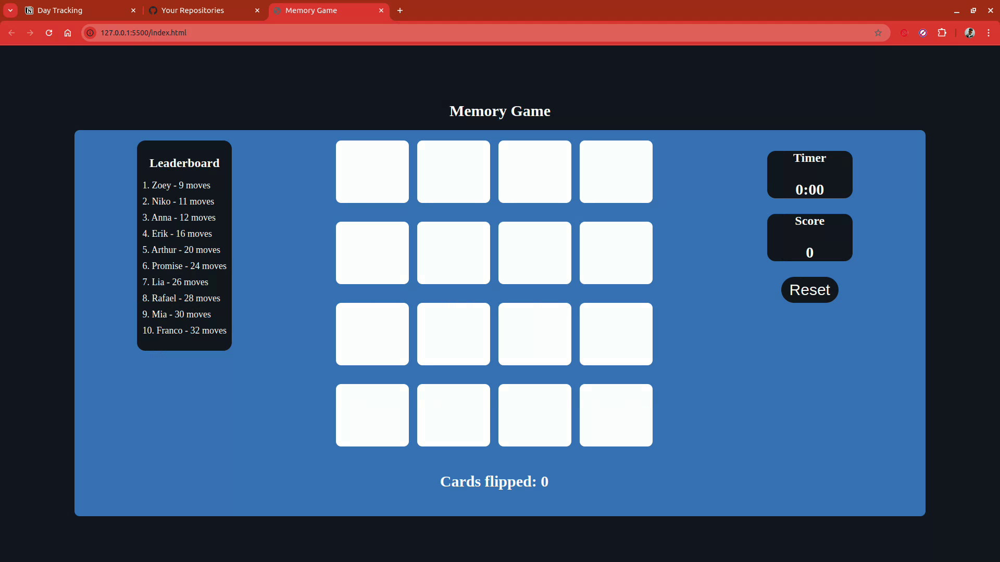
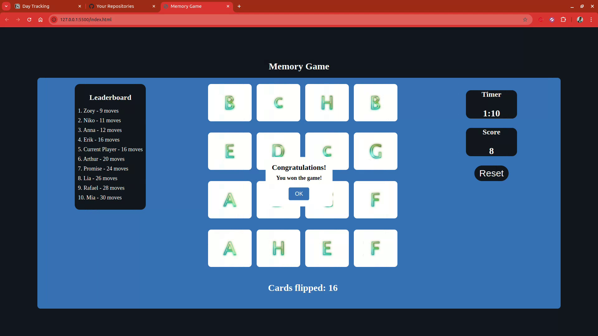

# Memory Game
This is a memory game developed in html, css and javascript. It is a game where you have to match the cards with the same symbol. The main objective to make this project was to learn web development and tools used in web development. It makes use of Jest and Jsdom for testing.

## Output

## Project Status 

1. The core functionality is completed

2. Additional features that I am looking to have implemented:
    - Adjustable difficulty (e.g. be able to choose between 4x4 or 6x6)
    - Leaderboard database

## System Requirements:
- A desktop with a browser
- A linux operating system

## How to Play
- Run index.html in your browser
- Click on the cards and try to match the cards quickly
    
## Contributing

Contributions are welcome! If you find any issues or have suggestions for improvements, please open an issue or submit a pull request.

## Contributor

Nkosikhona Mlaba (nkosimlaba397@gmail.com)

## License

This project is licensed under the MIT License.